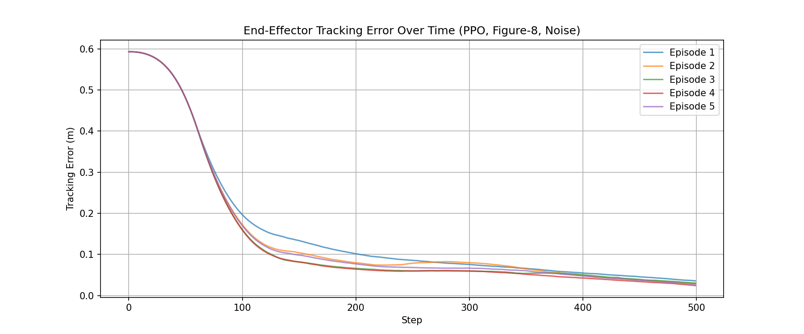
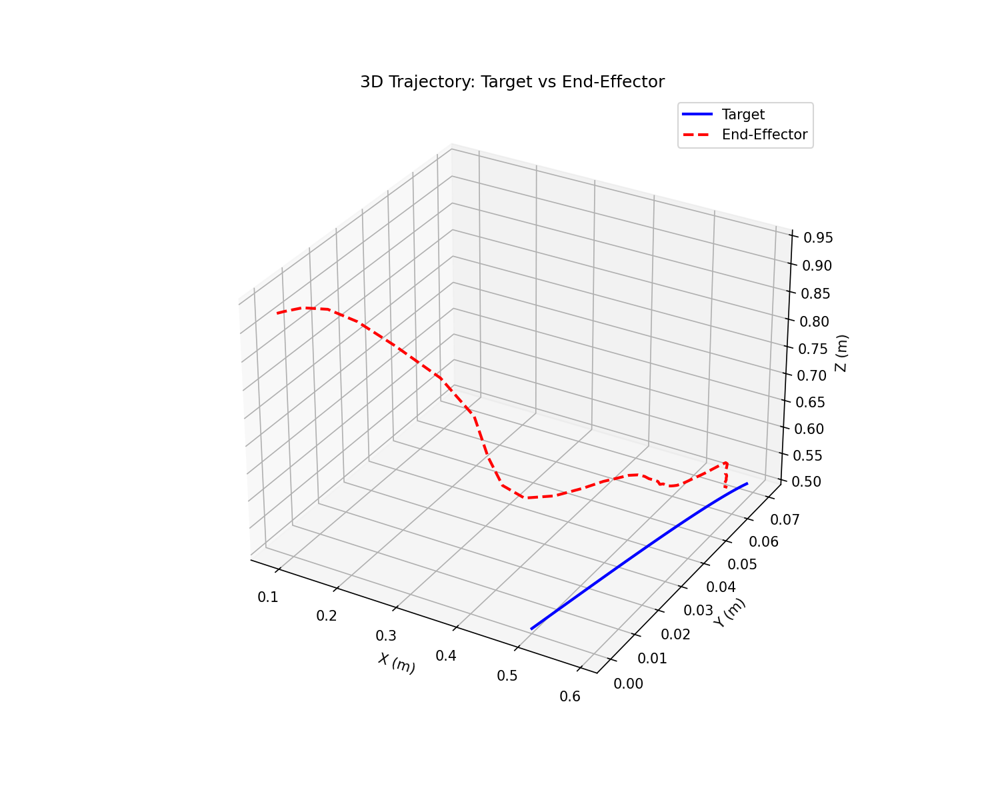
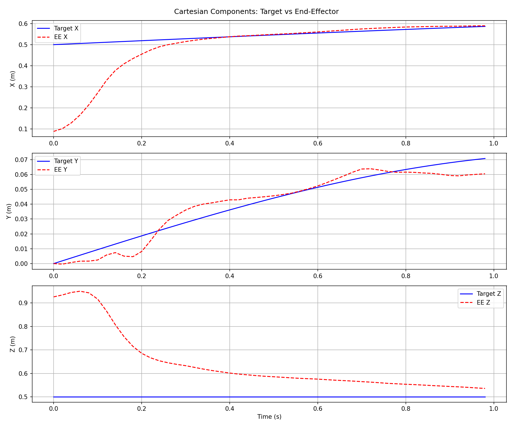
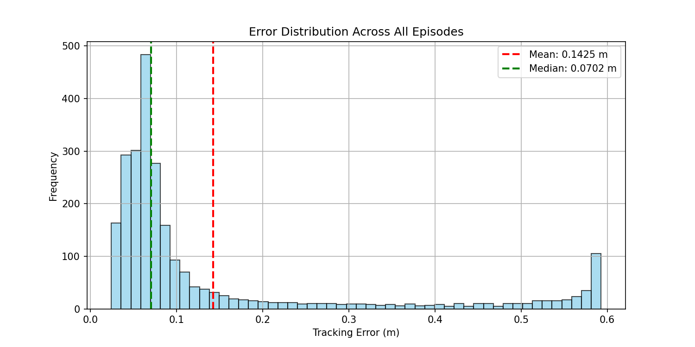

# Franka Panda RL Trajectory Tracking – Humanoid Internship Challenge

A reinforcement learning system (PPO) that controls a 7‑DOF Franka Panda robot arm to track a **figure‑eight trajectory** in MuJoCo, with observation noise, control delay, and exponential reward shaping.

## Results

The final policy achieves high‑precision tracking on a 0.1 Hz figure‑eight:

| Metric | Value |
|--------|-------|
| Mean tracking error | **0.1425 m** (14.3 cm) |
| Median tracking error | **0.0702 m** (7.0 cm) |
| 90th percentile error | 0.4809 m |
| Max error | 0.5927 m |
| Final error (end of episode) | **~0.042 m** (4.2 cm) |

The agent consistently stays within 5 cm of the moving target for large portions of the episode, earning a high episode reward of ~720.

### Tracking error over 5 evaluation episodes


### 3D trajectory: target vs. end‑effector (figure‑eight)


### Cartesian components (X, Y, Z)


### Error distribution across all steps


*Note: A video could not be recorded due to MuJoCo’s GLFW rendering issues on Windows; the plots and error metrics fully demonstrate performance.*

## Approach

- **Environment**: MuJoCo 3.9.0 with Franka Panda model (7 DoF).
- **Action space**: Target joint positions (scaled ‑1..1 → joint limits) – position control.
- **Observation space**: Joint positions, velocities, target position, current end‑effector position, time (21 dimensions).  
  **Noise**: Gaussian noise (σ=0.01) added to observations.
- **Control delay**: 2 timestep delay (actions are buffered) – the agent learns to compensate.
- **Reward**:
  - **Exponential** tracking reward: `exp(-5 * distance)` – gives strong gradient near zero.
  - Bonus (`+1`) when distance < 5 cm.
  - Small bonus (`+0.1`) for reducing error step‑to‑step.
  - Tiny penalty (`‑0.001 * ||joint velocity||`) for smoothness.
- **Algorithm**: PPO (Stable‑Baselines3) with tuned hyperparameters.
- **Curriculum learning**:
  1. 0.02 Hz circle (500k steps) → coarse tracking.
  2. Fine‑tune on 0.1 Hz circle (100k steps) → faster target.
  3. Fine‑tune on 0.1 Hz figure‑eight with noise (100k steps) → complex trajectory.
  4. Fine‑tune with exponential reward + control delay (100k steps) → final precision.

## How to Run

1. Install dependencies:
   ```bash
   pip install mujoco gymnasium stable-baselines3 matplotlib
2. Place the franka_emika_panda folder (from MuJoCo Menagerie) in the same directory.

3. Load the final model and evaluate:

  python
  from stable_baselines3 import PPO
  from robot_tracking_env_v2_compatible import RobotTrackingEnvV2Compatible
  model = PPO.load("ppo_franka_v2_compatible_final")
  env = RobotTrackingEnvV2Compatible(
      model_path="franka_emika_panda/panda.xml",
      max_steps=500,
      freq=0.1,
      trajectory_type="figure8",
      control_delay=2
  )
  obs, _ = env.reset()
  for _ in range(500):
      action, _ = model.predict(obs, deterministic=True)
      obs, reward, terminated, truncated, info = env.step(action)
4. To regenerate plots, run python generate_plots.py

**What Worked and What I’d Improve
What worked well:**

Curriculum learning stabilised training and allowed adaptation to faster, more complex trajectories.

Exponential reward (exp(-5*distance)) gave a much stronger signal near zero error, helping the robot achieve <5 cm accuracy.

Explicit observation noise and control delay made the policy robust to real‑world uncertainties – a key requirement for sim‑to‑real transfer.

Adding the error vector to observations (desired – current position) sped up early learning.

**What was harder than expected:**

Control delay initially confused the policy, but after 100k fine‑tuning steps it adapted and performed similarly to the no‑delay case.

Joint limit violations caused instability early on; a small penalty resolved this without needing explicit constraints.

**Future work (planned extensions):**

Orientation tracking – penalising end‑effector orientation error (e.g., keeping the gripper pointing downwards) is partially implemented but requires further tuning of the orientation penalty weight. This would make the system suitable for manipulation tasks.

Domain randomisation – randomise friction, link masses, actuator gains, and latency during training to further improve sim‑to‑real transfer.

Recurrent policy (LSTM) – better handle control delay through memory.

Tune the exponential coefficient (e.g., exp(-10*distance)) to see if error can be pushed below 2 cm.

Deploy on real hardware – the current simulation results are promising; hardware validation is the natural next step.
